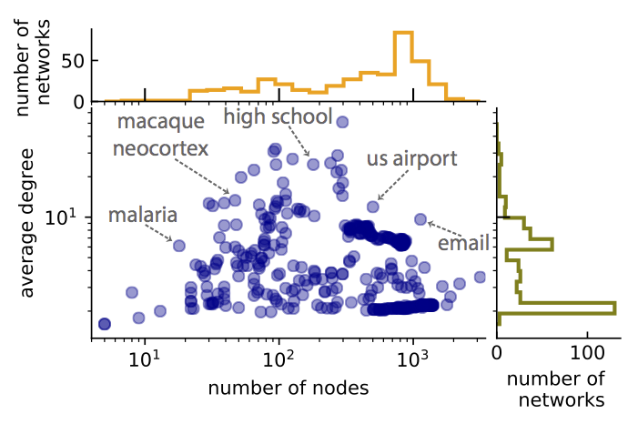

# CommunityFitNet

This page is a companion for our paper on 
overfitting and underfitting on real networks, written by [Amir Ghasemian](https://sites.google.com/site/amirghasemian/Home), [Homa Hosseinmardi](https://sites.google.com/site/homahosseinmardi/home), and 
[Aaron Clauset](http://santafe.edu/~aaronc/).
The page hosts the partitions created by each method in our comparison set of community detection algorithms (Table 1 of the paper).

                  **Table 1 of the paper**

Our goal is to provide a community detection benchmark used as a standardized reference for comparing community detection methods. The proposed package here contains both the benchmark and the partitions for each included network obtained by the algorithms evaluated in our paper. To compare a new algorithm with those in our evaluation set of algorithms, a researcher can run the new algorithm on the proposed benchmark, and identify which reference algorithm has the most similar behavior, e.g., in the average number of communities found (Fig. 2 of the paper). We belive the availability of this benchmark and the results of running so many state-of-the-art algorithms on it should facilitate further advances in developing community detection algorithms.

                  **Fig. 2 of the paper**

### Reference:
Amir Ghasemian, Homa Hosseinmardi, and Aaron Clauset.
["Evaluating and Comparing Overfit in Models of Network Community Structure (2017)"](http://arxiv.org/abs/...)

### Download the package:

<a href="Benchmark/CommunityFitNet.csv">Download CSV Format</a> , 
<a href="Benchmark/CommunityFitNet.txt">Download JSON Format</a> , 
<a href="Benchmark/CommunityFitNet.pickle">Download Pickle Format</a> .

The proposed package contains the novel corpus of 406 real-world networks from many scientific domains drawn from the Index of Complex Networks (<a href="https://icon.colorado.edu/#!/">ICON</a>). This corpus spans a variety of sizes and structures, with 30% social, 27% economic, 32% biological, 9% technological, 1% information, and 1% transportation graphs (Fig. 1 of the paper). In addition to the metadata extracted for each network we provide the partitions achieved by our set of chosen algorithms in our paper for further study and comparisons by other researchers in the field.

                  **Fig. 1 of the paper**
