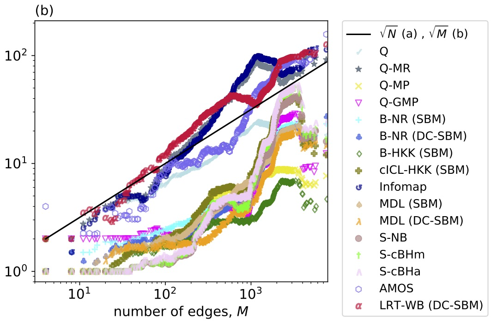
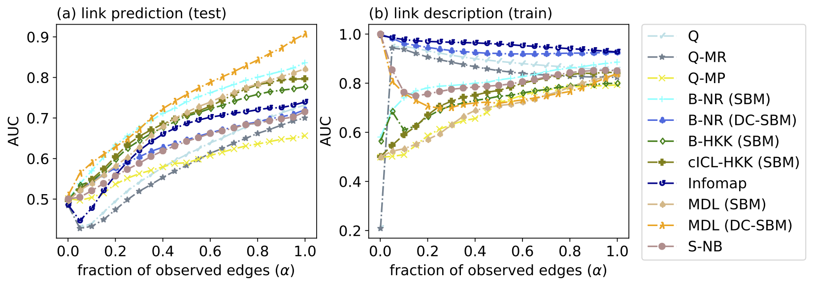
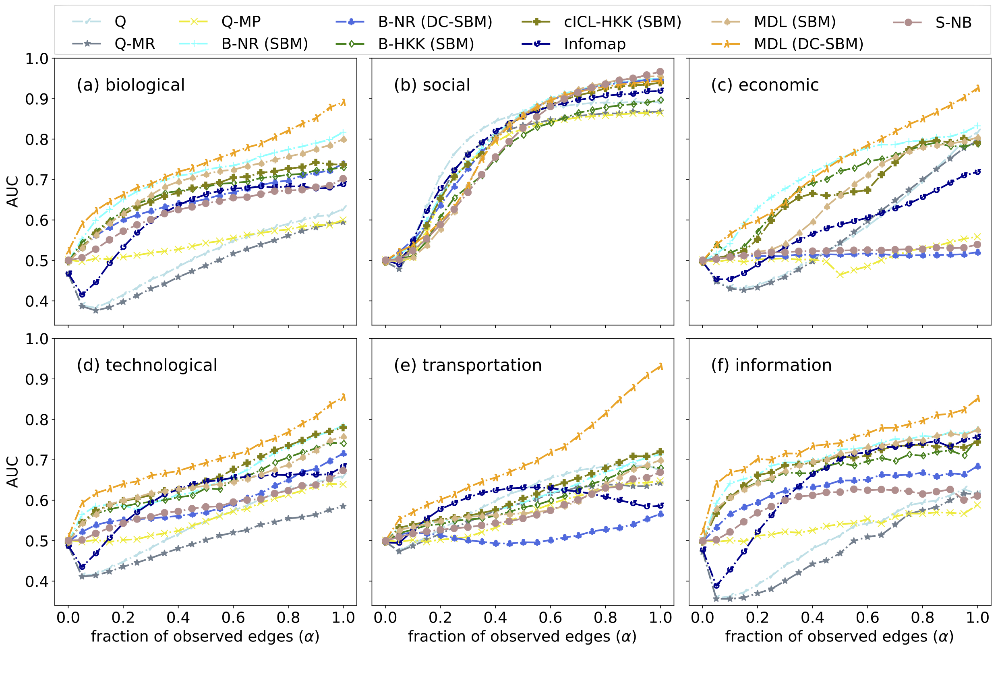
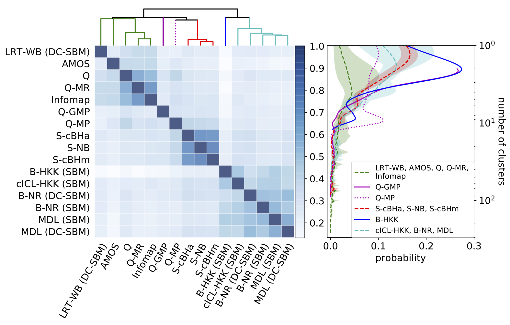
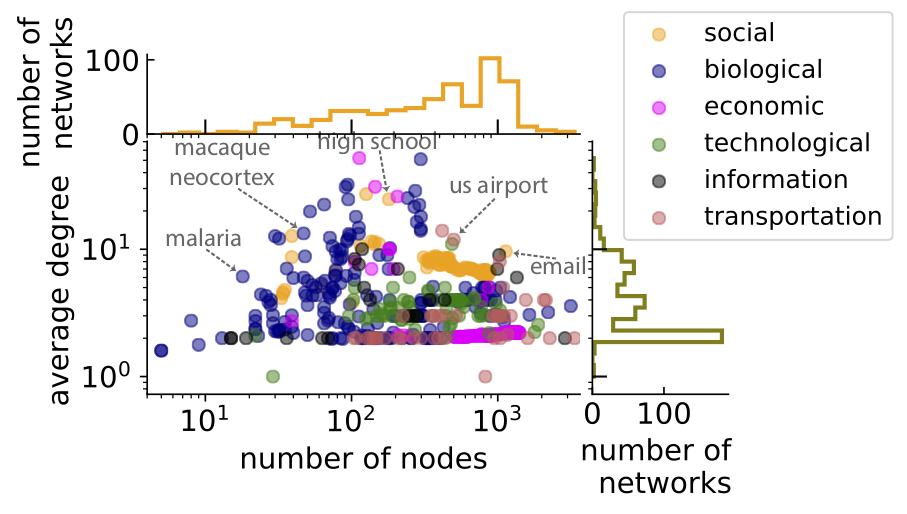
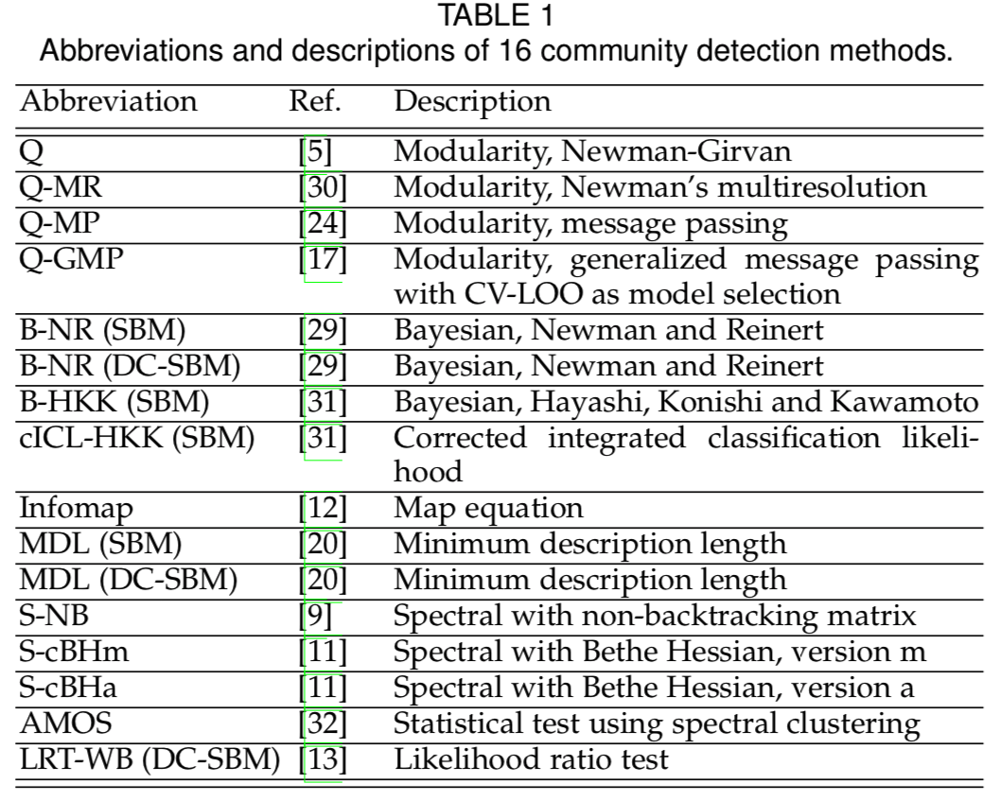

# CommunityFitNet

 

This page is a companion for our paper on 
overfitting and underfitting of community detection methods on real networks, written by <a href = "https://sites.google.com/site/amirghasemian/Home">Amir Ghasemian</a>, <a href = "https://sites.google.com/site/homahosseinmardi/home">Homa Hosseinmardi</a>, and <a href="http://santafe.edu/~aaronc/">Aaron Clauset</a>. CommunityFitNet provides both (i) a reference set of networks and (ii) partitions of those networks for a large set of state-of-the-art community detection algorithms (Table 1 of the paper).

 The purpose of this package is to facilitate between-algorithm comparisons on a large and realistic corpus of network data sets drawn from a variety of domains and of a variety of sizes. The qualitative behavior of new community detection algorithms can be assessed by comparing their partitions to those in the reference set. To compare a new algorithm with those in our evaluation set of algorithms, a researcher can run the new algorithm on the proposed benchmark, and identify which reference algorithm has the most similar behavior, e.g., in the average number of communities found (Fig. 2b of the paper). We believe the availability of this benchmark and the results of running so many state-of-the-art algorithms on it should facilitate further advances in developing community detection algorithms.

 
<b>Fig. 2b of the paper</b>

### Overfitting and Underfitting among different clustering algorithms

General algorithms like MDL, Bayesian methods and regularized-likelihood algorithms tend to perform very well under different settings and can be used as reference methods for comparing with new methods. Additionally, popular methods like Infomap and modularity tend to over-fit in practice and are thus not generally reliable, at least under link prediction (Fig. 5 of the paper). However, when these more specialized methods are paired with their preferred inputs, they tend to perform much better (Fig. 8 of the paper). Generally community detection algorithms can be categorized into two general settings of probabilistic and heuristic methods. This dichotomy can be seen in the hierarchical clustering of 16 state-of-the-art community detection algorithms (Fig. 4 of the paper).

 
<b>Fig. 5 of the paper</b>

 
<b>Fig. 8 of the paper</b>

 
<b>Fig. 4 of the paper</b>

### Reference:

<a>To appear, IEEE Trans. Knowledge and Data Engineering (TKDE) (2019),
 <b>Evaluating and Comparing Overfit in Models of Network Community Structure</b></a>
 <b>Amir Ghasemian</b>, Homa Hosseinmardi, and Aaron Clauset
  (<a href="https://arxiv.org/abs/1802.10582" target="_blank"> arXiv version </a>)

### Download the package:

<a>Download JSON Format (To Be Added)</a>, 
<a href="Benchmark/CommunityFitNet.pickle">Download Pickle Format</a>.

Note: Previously the CSV Format was also provided. We found some issues in that file and removed it. 

This package contains the corpus of 572 real-world networks from many scientific domains drawn from the Index of Complex Networks (<a href="https://icon.colorado.edu/#!/">ICON</a>). This corpus spans a variety of sizes and structures, with 22% social, 21% economic, 34% biological, 12% technological, 4% information, and 7% transportation graphs (Fig. 1 of the paper). In addition to the information about each network, we provide the partitions achieved by our set of chosen algorithms in our paper for further study and comparisons by other researchers in the field.

 
<b>Fig. 1 of the paper</b>

 
<b>Table 1 of the paper</b>

