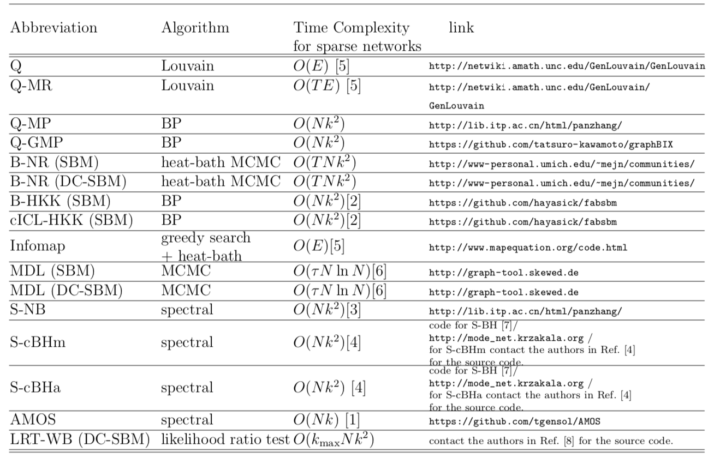

<html>
<head>
<script type="text/x-mathjax-config">
  MathJax.Hub.Config({tex2jax: {inlineMath: [['$','$'], ['\\(','\\)']]}});
</script>
<script type="text/javascript"
  src="http://cdnjs.cloudflare.com/ajax/libs/mathjax/2.7.1/MathJax.js?config=TeX-AMS-MML_HTMLorMML">
</script>
</head>
# CommunityFitNet
<p align="center">
<br>
</p>

<p align="justify">This page is a companion for our paper on 
overfitting and underfitting of community detection methods on real networks, written by <a href = "https://aghasemian.github.io">Amir Ghasemian</a>, <a href = "https://homahm.github.io">Homa Hosseinmardi</a>, and <a href="http://santafe.edu/~aaronc/">Aaron Clauset</a>. CommunityFitNet provides both (i) a reference set of networks and (ii) partitions of those networks for a large set of state-of-the-art community detection algorithms (Table 1 of the paper).</p>

<p align="justify"> The purpose of this package is to facilitate between-algorithm comparisons on a large and realistic corpus of network data sets drawn from a variety of domains and of a variety of sizes. The qualitative behavior of new community detection algorithms can be assessed by comparing their partitions to those in the reference set. To compare a new algorithm with those in our evaluation set of algorithms, a researcher can run the new algorithm on the proposed benchmark, and identify which reference algorithm has the most similar behavior, e.g., in the average number of communities found (Fig. 2b of the paper). We believe the availability of this benchmark and the results of running so many state-of-the-art algorithms on it should facilitate further advances in developing community detection algorithms.</p>

<p align="center">
<br>
<b>Fig. 2b of the paper</b>
</p>

### Overfitting and Underfitting among different clustering algorithms
<p align="justify">General algorithms like MDL, Bayesian methods and regularized-likelihood algorithms tend to perform very well under different settings and can be used as reference methods for comparing with new methods. Additionally, popular methods like Infomap and modularity tend to over-fit in practice and are thus not generally reliable, at least under link prediction (Fig. 4 of the paper). However, when these more specialized methods are paired with their preferred inputs, they tend to perform much better (Fig. 6 of the paper). Generally community detection algorithms can be categorized into two general settings of probabilistic and heuristic methods. This dichotomy can be seen in the hierarchical clustering of 16 state-of-the-art community detection algorithms (Fig. 3 of the paper).</p>

<p align="center">
<br>
<b>Fig. 4 of the paper</b>
</p>

<p align="center">
<br>
<b>Fig. 6 of the paper</b>
</p>

<p align="center">
<br>
<b>Fig. 3 of the paper</b>
</p>

### Reference:
<p><a>To appear, IEEE Trans. Knowledge and Data Engineering (TKDE) (2019),
<br><b>Evaluating and Comparing Overfit in Models of Network Community Structure</b></a>
<br><b>Amir Ghasemian</b>, Homa Hosseinmardi, and Aaron Clauset
<br> (<a href="https://arxiv.org/abs/1802.10582" target="_blank"> arXiv version </a>)</p>

### Download the package:
<p align="left">
<a>Download JSON Format (To Be Added)</a>,<br>
<a href="Benchmark/CommunityFitNet.pickle">Download Pickle Format</a>.</p>
Note: Previously the CSV Format was also provided. We found some issues in that file and removed it. 

<p align="justify">This package contains the corpus of 572 real-world networks from many scientific domains drawn from the Index of Complex Networks (<a href="https://icon.colorado.edu/#!/">ICON</a>). This corpus spans a variety of sizes and structures, with 22% social, 21% economic, 34% biological, 12% technological, 4% information, and 7% transportation graphs (Fig. 1 of the paper). In addition to the information about each network, we provide the partitions achieved by our set of chosen algorithms in our paper for further study and comparisons by other researchers in the field.</p>

### Instruction for using the package:

<p align="justify"> To load the data:</p>

```python 
import pickle  
# load the data 
infile = open('./CommunityFitNet.pickle','rb')  
df = pickle.load(infile)  

# read edge lists for all networks
df_edgelists = df['edges_id'] # column 'edges_id' in dataframe df includes the edge list 
                              # for each network 
 
# extract the edge list for the first network 
edges_orig = df_edgelists.iloc[0] # a numpy array of edge list for original graph 
```


<p align="center">
<br>
<b>Fig. 1 of the paper</b>
</p>

<p align="center">
<br>
<b>Table 1 of the paper</b>
</p>

### Source of the codes and the time complexity of the algorithms:
<p align="justify">In the following table the time Complexity and the link of the code for community detection methods have been used in the paper are provided. In the time complexity column, $N$ is the number of nodes, $E$ is the number of edges, $k$ is the number of communities, $k_{\max}$ is the maximum number of clusters considered in model selection, $T$ is the number of iterations for convergence, and $\tau$ is the mixing time of the Markov chain in corresponding algorithm. The maximum number of clusters considered in model selection, $k_{\max}$, is $O(\sqrt{N})$. Therefore, the time complexity of LRT-WB can be simplified as $O(N^{3/2} k^2)$.</p>

<p align="justify"> Note: Here, the time complexities are provided for the algorithms and the time complexity of the codes are possibly different than the ones in the table.

<p align="center">
<br>
<b>Table of time complexity and the link of the codes have been used for community detection algorithms</b>
</p>

##### References in the table:
<p><a>[1] P.-Y. Chen. Analysis and actions on graph data. 2016.</a>
<p><a>[2] K. Hayashi, T. Konishi, and T. Kawamoto. A tractable fully Bayesian method for the
stochastic block model. arXiv:1602.02256, 2016.</a>
<p><a>[3] F. Krzakala, C. Moore, E. Mossel, J. Neeman, A. Sly, L. Zdeborova, and P. Zhang. Spectral redemption in clustering sparse networks. Proc. Natl. Acad. Sci., 110(52):20935– 20940, 2013.</a>
<p><a>[4] C. M. Le and E. Levina. Estimating the number of communities in networks by spectral methods. arXiv:1507.00827, 2015.</a>
<p><a>[5] A. Mukherjee, M. Choudhury, F. Peruani, N. Ganguly, and B. Mitra. Dynamics On and Of Complex Networks, Volume 2: Applications to Time-Varying Dynamical Systems. Springer Science & Business Media, 2013.</a>
<p><a>[6] T. P. Peixoto. Parsimonious module inference in large networks. Phys. Rev. Lett., 110(14):148701, 2013.</a>
<p><a>[7] A. Saade, F. Krzakala, and L. Zdeborova. Spectral clustering of graphs with the Bethe Hessian. In Adv. Neural Info. Proc. Sys., pages 406–414, 2014.</a>
<p><a>[8] Y. R. Wang, P. J. Bickel, et al. Likelihood-based model selection for stochastic block models. Ann. Stat., 45(2):500–528, 2017.</a>